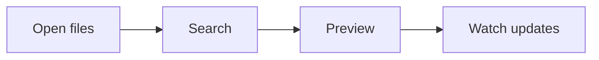

# Markdown Sample

This file exercises plain Markdown rendering, frontmatter display, full-text
search, tables, and Mermaid.

## Table

| Feature | Status |
| --- | --- |
| Markdown | Ready |
| Search | Ready |
| Mermaid | Ready |

## Mermaid

## Text Search

Search for `watch updates` to find this paragraph.
