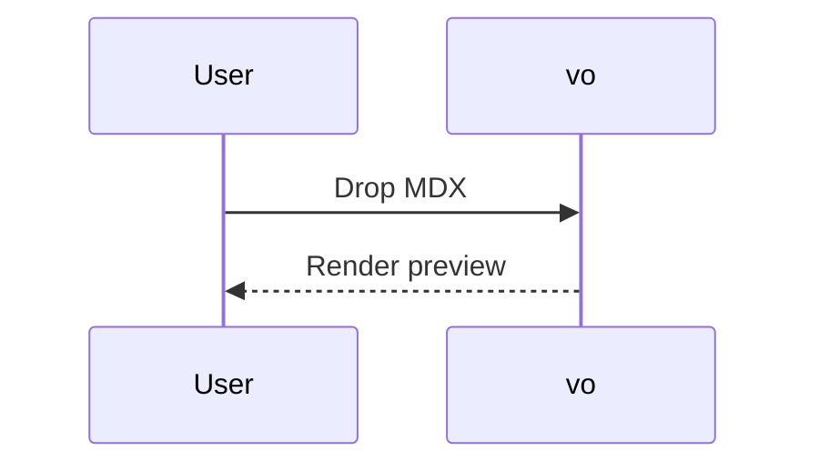

import { Callout } from "./components";

export const meta = {
  title: "MDX Sample",
};

# MDX Sample

MDX module lines are ignored for viewing, and JSX components are shown as text
instead of being executed.

<Callout tone="info">This JSX is rendered as escaped text.</Callout>

Try searching for `escaped text`.
